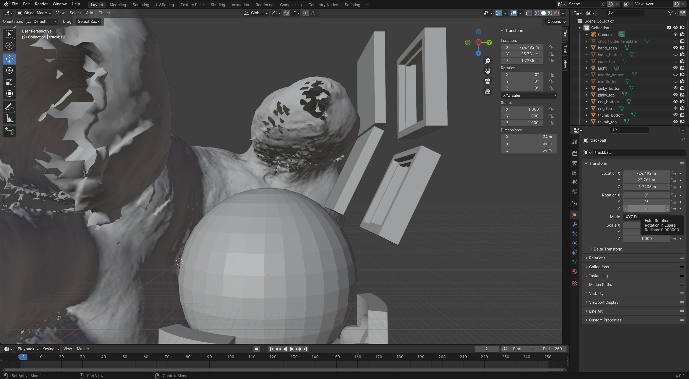
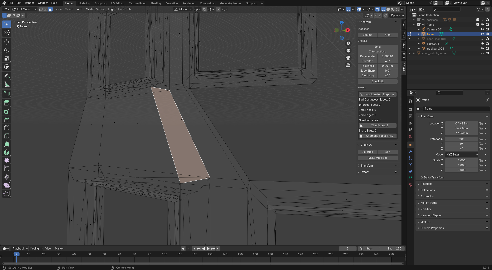

<!-- omit from toc -->
# Design and build guide

Learn how to create your own Wearabord, tailored to the size and shape of your hands, using this beginner friendly guide.

In this guide you can learn how to:

- Order PCBs from [JLCPCB](https://jlcpcb.com/) (optional)
- Make a high resolution 3D scan (optional)
- Use CAD software (optional)
- 3D model
- 3D print (optional)
- Solder
- Use [QMK](https://qmk.fm/) (optional)

If you are running into any problems while following this guide, feel free to [open an issue](https://docs.github.com/en/issues/tracking-your-work-with-issues/creating-an-issue) in this GitHub repository.

<!-- omit from toc -->
## Overview

- [Glossary](#glossary)
- [Requisites](#requisites)
  - [Software](#software)
  - [Tools](#tools)
  - [Parts](#parts)
    - [Keyboard parts](#keyboard-parts)
    - [Trackball parts](#trackball-parts)
    - [Additional parts](#additional-parts)
- [Ordering parts](#ordering-parts)
  - [Recommended option](#recommended-option)
  - [Alternative option](#alternative-option)
- [Scanning your hand](#scanning-your-hand)
- [Designing the key switch holders](#designing-the-key-switch-holders)
  - [Beginner friendly printing instructions](#beginner-friendly-printing-instructions)
  - [Designing the switch holder from scratch](#designing-the-switch-holder-from-scratch)
  - [Adjusting the tolerances of the switch holder](#adjusting-the-tolerances-of-the-switch-holder)
- [Designing the keyboard frame](#designing-the-keyboard-frame)
  - [Using a scan of your hand](#using-a-scan-of-your-hand)
    - [Key switch holder model cleanup](#key-switch-holder-model-cleanup)
  - [Using my personal design as a basis](#using-my-personal-design-as-a-basis)
  - [Connecting the key positions](#connecting-the-key-positions)
  - [Adding holes for the screw inserts](#adding-holes-for-the-screw-inserts)
  - [Getting the frame ready to 3D Print](#getting-the-frame-ready-to-3d-print)
- [Assembling](#assembling)
  - [Microcontroller holder](#microcontroller-holder)
  - [Sensor assembly](#sensor-assembly)
  - [Sensor mount](#sensor-mount)
- [Flashing firmware](#flashing-firmware)

## Glossary

| Term                                     | Description                                                                                                                                                                                                                                             |
| ---------------------------------------- | ------------------------------------------------------------------------------------------------------------------------------------------------------------------------------------------------------------------------------------------------------- |
| PCB                                      | Printed circuit board, this is basically a bunch of wires inside of a piece of plastic that can also contain holes or pads which allow you to solder and connect electronic components                                                                  |
| Assembled PCB (PCBA)                     | A PCB with electronic components soldered to it                                                                                                                                                                                                         |
| Breakout board                           | A PCB that allows you to easily solder connections to the pins of a specific electronic component                                                                                                                                                       |
| Microcontroller                          | A breakout board for a microcontroller chip                                                                                                                                                                                                             |
| Pro Micro (compatible/footprint/drop in) | The [Pro Micro](https://www.sparkfun.com/products/12640) is an old and popular microcontroller that has a footprint on which a lot of modern microcontrollers (intended for keyboard building) are based.                                               |
| Elite-C                                  | A popular Pro Micro replacement that uses the same form factor and a USB-C port instead of Micro USB                                                                                                                                                    |
| ATmega32u4 (based controller)            | A microcontroller chip that is used in a lot of microcontrollers that are intended to be used for keyboard building                                                                                                                                     |
| RP2040 (based controller)                | A microcontroller chip that is used in more recent microcontrollers intended to be used for keyboard building                                                                                                                                           |
| (pin) Headers                            | Metal pins that can be soldered onto a microcontroller. Male headers can be used to mount a microcontroller to a PCB and conduct electronic signals and current. Headers also allow for the use of [jump wire](https://en.wikipedia.org/wiki/Jump_wire) |
| CAD (software)                           | Computer-aided design software, can be used to make technical drawings using precise measurements for digital 2D or 3D objects                                                                                                                          |
| QMK firmware                             | Firmware that is used to program the microcontroller that allows, among other things, the microcontroller to send keystrokes to the device it's plugged into when a key switch is pressed                                                               |
| QMK configuration                        | Text based configuration of your keyboard, what keyboard layout (keymap) it uses, how many key switches it has, what kind of sensor you are using for your trackball, etc.                                                                              |
| QMK CLI                                  | Command line interface to compile (convert human readable code into machine code the microcontroller can understand) your QMK configuration into a firmware file                                                                                        |
| Flashing firmware                        | The process of uploading your firmware file to your microcontroller                                                                                                                                                                                     |

## Requisites

You need the following things to follow this guide.

### Software

The following software will be used in the guide,

required:

- [Blender](https://www.blender.org/download/) (version 4.0)

potentially optional:

- [Freecad](https://www.freecad.org/downloads.php) (version 0.20)
- [Cura](https://ultimaker.com/software/ultimaker-cura/#downloads) (version 5.4.0)
- [Scandy Pro](https://apps.apple.com/us/app/scandy-pro-3d-scanner-3d-app/id1388028223) (iOS/iPadOS)
- [QMK](https://docs.qmk.fm/#/newbs)

The version numbers of the software used in this guide are listed for completeness, feel free to install the latest versions.

### Tools

| Description                    | Notes                                                                                               |
| ------------------------------ | --------------------------------------------------------------------------------------------------- |
| iOS/iPadOS device with Face ID | To make a 3D scan of your hand (optional)                                                           |
| Soldering iron                 | For heating up the screw inserts and soldering                                                      |
| 3D printer                     | Having your own makes iterating a lot quicker, alternatively, use a 3D printing service like JLCPCB |
| Wire stripper                  | To remove the insulation from the wires (optional)                                                  |
| Multimeter                     | To test the solder connections for continuity (optional)                                            |
| Lighter                        | For melting the parts of the frame that touch your hand to make them smoother (optional)            |

### Parts

The parts used for this project will set you back approximately €30 per hand, and an additional €70 for one trackball or €110 for two trackballs, this is assuming you have free access to the required tools and already own the required consumable materials (wire, filament and solder wire). These prices are based on shipping to Europe. If you don't live in Europe it might be worthwile to look into sourcing alternative trackball parts, [like this one](https://www.tindie.com/products/citizenjoe/pmw3360-motion-sensor/) and using [an adapter](https://www.printables.com/en/model/619514-pmw3360-tindie-board-to-charybdis-bastardkb-adapte).
<details>
  <summary>Alternative trackpad option</summary>

  A cheaper, alternative mouse input sensor is the 40mm round and curved Cirque trackpad which is only €8, but shipping is €20, at this time there aren't instructions provided for this option in this guide but you could take a look at [this guide](https://beekeeb.com/cirque-trackpad-i2c-on-corne-keyboard/) or [this one (don't forget the track pad pull up resistors when using I2C, they aren't mentioned in this guide)](https://github.com/Bastardkb/Dilemma/blob/main/3x5_2/build_guide.md) and use [the following QMK config](https://github.com/qmk/qmk_firmware/tree/master/keyboards/bastardkb/dilemma/3x5_2/splinky) which can be built using ```qmk compile -c -kb bastardkb/dilemma/3x5_2/splinky -km default``` in QMK MSYS.

</details>

#### Keyboard parts

This list is for **one hand**, if you want to make the Wearabord for both hands make sure to get two of everything and two of the same kind of microcontroller.

| Description                                                                         | Notes                                                                                                                             |
| ----------------------------------------------------------------------------------- | --------------------------------------------------------------------------------------------------------------------------------- |
| Pro Micro-compatible microcontroller                                                | You could also use a WaveShare RP2040-zero as a cheap alternative, but this option requires an alternative microcontroller holder |
| Pink Kailh Low Profile Choc Switches (x10)                                          | MX switches can also be used but I recommend low actuation force and low profile switches                                         |
| Keycaps (x10)                                                                       | I recommend low profile keycaps                                                                                                   |
| Hotswap sockets (x10)                                                               | I used Choc Kailh Hotswap Sockets but these aren't required                                                                       |
| 1N4148 Diodes (x10)                                                                 | You could also go diodeless if you want                                                                                           |
| [Microcontroller holder](https://github.com/Bastardkb/Elite-C-holder) (version 2.0) | To mount your microcontroller and audio jack (see [Ordering PCBs](#ordering-pcbs) for an alternative option)                      |
| M4 screw inserts (x2)                                                               | To mount the microcontroller holder to the frame (not necessary if you aren't using the holder)                                   |
| 8mm M4 screws (x2)                                                                  | To mount the microcontroller holder to the frame (not necessary if you aren't using the holder)                                   |
| Male pin headers for all pins on the microcontroller                                | To solder the microcontroller onto the holder (not necessary if you aren't using the holder)                                      |
| TRRS Jack                                                                           | To connect the right hand's board to the left (part number PJ-320D or similar looking)                                            |

#### Trackball parts

These are the parts required for one trackball, you can decide for yourself how many you want.

| Description                            | Notes                                                                                                                                                                                                               |
| -------------------------------------- | ------------------------------------------------------------------------------------------------------------------------------------------------------------------------------------------------------------------- |
| 34mm trackball                         | The Perixx PERIPRO-303 GSL is objectively the best one since it's shiny and iridescent                                                                                                                              |
| Assembled Charybdis sensor PCB         | I used the [PMW3360](https://github.com/Bastardkb/charybdis-pmw-3360-sensor-pcb) one (version 1.7), consider the [PMW3610](https://github.com/ufan/charybdis-pmw3610-breakout) if you want to go wireless using ZMK |
| PMW3360 sensor with lens               | This part is included if you [buy a PMW3360 sensor breakout from bastardkb](https://bastardkb.com/product/pmw3360-sensor-breakout/)                                                                                 |
| M3 screw inserts (x2)                  | To mount the sensor PCB to the frame                                                                                                                                                                                |
| 8mm M3 screws (x2)                     | To mount the sensor PCB to the frame                                                                                                                                                                                |
| 2.5mm Ceramic Bearing Balls (ZrO2, x3) | The trackball is placed on top of these to roll smoothly. You can also use ball transfer units, they have [lower friction and are louder](https://kbd.news/Trackball-bearing-comparison-1757.html)                  |

#### Additional parts

| Description               | Notes                                                                                                                                              |
| ------------------------- | -------------------------------------------------------------------------------------------------------------------------------------------------- |
| Male to male TRRS cable   | To connect the right hand to the left                                                                                                              |
| Male to male USB-C cable  | For flashing the firmware and connecting your keyboard to a computer                                                                               |
| PLA filament for printing | Using a printing service as an alternative (e.g. JLCPCB) is possible but not ideal because you'll likely have to iterate the fit and key positions |
| Wire                      | To connect the switches and sensor to the controller (I used single core, stranded, 26AWG)                                                         |
| Solder wire               | I used lead-free (lead is considered harmful to humans) wire to solder the wires, headers and TRRS jack                                            |

## Ordering parts

You can go with any of the suggested options for ordering the PCBs listed below, all other parts can be ordered through AliExpress or [your favorite local keyboard shop](https://kbd.news/vendors). It's also possible to order PCBs through manufacturers other than JLCPCB.

### Recommended option

If you want only one trackball in total, this option is probably the cheapest. You can order the PMW3360 sensor breakout from Bastard Keyboards [here](https://bastardkb.com/product/pmw3360-sensor-breakout/) to support open-source keyboard design. If you choose this option you don't have to order the PMW3360 sensor separately, as it will be included. If you don't live in Europe it might be worthwile to look into sourcing trackball parts elsewhere, [like here](https://www.tindie.com/products/citizenjoe/pmw3360-motion-sensor/) and using [an adapter](https://www.printables.com/en/model/619514-pmw3360-tindie-board-to-charybdis-bastardkb-adapte).

If you don't feel like placing an order at JLCPCB or any other manufacturer for the [microcontroller holder](https://github.com/Bastardkb/Elite-C-holder) you can try to connect a 3D printable holder to your Wearabord 3d model, you'll learn how to do such a thing later on in this guide. There are a few ready made 3D printable holders for the following microcontrollers:

- [WaveShare RP2040-Zero](https://www.printables.com/model/701889-dactyl-manuform-external-holder-for-waveshare-rp20)
- [AITRIP Pro Micro (USB-C)](https://www.printables.com/model/152130-dactyl-maniform-pro-micro-v2-type-c-sled)
- [Elite-C Low Profile](https://www.thingiverse.com/thing:4809401)
- [Elite-C](https://www.thingiverse.com/thing:4693404)

You might need to adjust the height of the USB-C slot if you go for one of the last three options if you are using a different Pro Micro footprint controller than the one the model was design for, you'll also learn how to do such a thing later on in this guide.

If your controller is not listed, you might be able to download a mount STL file using the beta of rianadon's [Cosmos Keyboard Configurator](https://ryanis.cool/cosmos/)

### Alternative option

Alternatively, you can place an order at JLCPCB or any other PCB manufacturer. I will provide instructions on how to do it through JLCPCB but chances are that the process is similar elsewhere (except for the part numbers). Ordering from here cost me $36,70 for 5 assembled sensor pcb's and 5 left and right microcontroller holder pcb's. The shipping (to europe) was $20.59 and the duties/taxes were $16.80. I placed this order about a year ago so prices may be different now, there may also be discounts available. Keep in mind that you also need to order the actual PMW3360 sensor separately if you go with this option (it's about $10).

You could save $25.62 by doing the assembly yourself and ordering [the 1.51 DIY version of the pcb](https://github.com/Bastardkb/charybdis-pmw-3360-sensor-pcb/releases/tag/1.51), but you would have to source the components required for assembly yourself (check this [readme](https://github.com/Bastardkb/charybdis-pmw-3360-sensor-pcb) for more info).

To order the assembled sensor PCB you need to download a couple of files first. Go to [this link](https://github.com/Bastardkb/charybdis-pmw-3360-sensor-pcb/releases/tag/1.7a) and click on BOM-sensor.csv, GERBER-sensor.zip and POS-sensor.csv to download them.

Then, go to [jlcpcb.com](https://jlcpcb.com/) and create an account. Afterwards click the [order now button](https://cart.jlcpcb.com/quote/). you should now see this page.


Press the add gerber file button and select the GERBER-sensor.zip you just downloaded. You don't have to change any of the options below but I changed the PCB color to black and the surface finish to LeadFree HASL (lead is considered harmful to humans).

Now scroll down and check the checkmark next to PCB Assembly. Select assemble bottom side. For the PCBA Qty you could go for 2 but might as well go for 5 as the price difference is minimal. I didn't check the confirm parts placement option and got an email to confirm the parts placement anyway, they weren't sure about the polarity (mounting orientation) of the TXS0104EDR (U1002) component, I'm not sure why since the rotation value was provided in the POS-sensor.csv but their proposed placement was correct. It wouldn't hurt to check the option so you might as well. Finally click the confirm button.

On the next screen you should see the bottom of the sensor PCB. Go ahead and click the next button. On the current page, click the add BOM file button and select the BOM-sensor.csv you downloaded earlier. Then, click the add CPL file button and select the POS-sensor.csv file you also downloaded earlier. Finally, click the process BOM & CPL button.

You should now see a table with all the components with 11 parts detected and 1 part not selected. The unselected part is the PMW3360 sensor that you need to order separately. Click the next button and then click on do not place if you get a notification about the unselected part. Next you should see a page displaying the top side of the PCB, you can press the bottom button to take a look at the bottom side with all the components placed in their positions. You don't need to change anything here so you can go ahead and click the next button.

Now you can see the order quote and save it to your cart after choosing the product description (you can go for Office Appliance and Accessories > Keyboard).

The correct parts placement is shown below, you might get an email asking to confirm it.


Now you can download the files for the microcontroller holder [here](https://github.com/Bastardkb/Elite-C-holder/releases/tag/2.0pre4) by clicking on 2.0pre4.zip. Go back to JLCPCB and click the order now button once again. Upload the 2.0pre4.zip zip file just like you did the other one. Once more, you don't have to change any of the options below but I changed the PCB color to black and the surface finish to LeadFree HASL for this PCB as well. Since the microcontroller holder doesn't require assembly you can go ahead and save the order to the cart without going through the PCB assembly steps.

You are now ready to check out.

## Scanning your hand

In order to figure out what positions for the key switches are most comfortable to type on, it is useful to create a 3D scan of your hand in a relaxed position. This scan will also be used to design the right fit for attaching the frame to your hand.

I used an Ipad (iPhones also work) with FaceID to make the scan. FaceID allows for scanning with greater resolution than the Lidar sensor found on some devices. There are a couple of scanning apps available, the one I landed on was Scandy Pro, which allows you to export one scan for free each week. You are able to create and save multiple scans before deciding which one you want to export.

**If you aren't able to get a hold of an Apple device with FaceID**: you could also try to print the model I designed for my hand, try the fit and use that as your basis for making changes.

I scanned my hand by placing the iPad on a table with the front camera facing downwards, positioned over the edge of the table. To make it easier to control the scanning app, I connected a mouse and mirrored the screen of the iPad to an external display. I was able to make the scan by rotating my wrist in one direction as far as I comfortably could, then pressing the scan button and then, while keeping my fingers as still as I could, rotating my wrist as far as possible in the other direction. Make sure to hold your fingers in a comfortable position that allows for enough movement to press the keys, as the scan will be used as your resting position in relation to the key switches. If it's hard to keep your hand still while rotating, you could also make a scan of just the palm of your hand, including your finger tips, and make a different scan for determining the thickness of your hand, which can be used to design the fit for attaching the frame to your hand.

https://github.com/wulphred/wearabord/assets/155734133/2957e917-d71c-49ba-88d3-b24bc0ad771e

If you are happy with the result of one of the scans, export it as an OBJ file, select MM for the scale option, enable the "Choose 3D editor" toggle and select Blender. Save it anywhere and transfer it to your computer.

In your computer, open Blender. In the menu that is in the center of the screen, select "General", under "New File". Click on the grey cube in the center and hit the ```Delete``` key on your keyboard. In the top left corner select "File" > "Import" > "Wavefront (.obj)" and select the scan you transferred to your computer. Save your current project by going to "File" > "Save" or using the shortcut ```Ctrl``` + ```S```

## Designing the key switch holders

The required tolerances of the holders in which the keys switches will be inserted can vary from printer to printer and also change based on the angle at which the frame is printed. For this reason I will include instructions on how to design the key switch holders in FreeCAD, which will allow you to adjust the tolerances and the give you the option have your Wearabord frame support key switches that vary from the standard MX or Choc footprints.

If your switches fit in one of the STL models I provided [here](https://github.com/wulphred/wearabord/tree/main/files/stl), you don't need to follow these steps. To test the tolerances of one of the provided models, simply download the STL file that matches the key switches you plan to use and print it once flat on the build plate (horizontal) and once with the Y and X axis rotated 45 degrees. Use a brim and no supports.


<details>
  <summary>Beginner friendly printing instructions</summary>

  ### Beginner friendly printing instructions

  To make test prints for the key switch holder in Cura, after installation and selecting the printer you are going to be using, open the STL and select the rotate tool (shortcut: ```R```). While having the model selected, drag the green circle until it says 45°, then, do the same for the red circle.
  
  In the top right corner, under the Marketplace button, you should see a button with a settings icon showing the print resolution (Standard Quality - 0.2 mm, for example). Click on this button and press the Show Custom button. In the menu that opens there is a search bar, click on in and enter "brim". Scroll down to the Build Plate Adhesion section and collapse it to reveal the Build Plate Adhesion Type setting. Open the drop down and select Brim. Depending on the build plate adhesion of the printer, you can adjust the width of the brim by changing the Brim Line Count value, I went for a value of 10.
  
  Now enter "generate support" in the search bar and make sure that the option is unchecked. Then, press the blue Slice button in the bottom right corner and Save the generated GCode file to send it to your printed, I saved it on an SD card which could be inserted into my printer. Make sure your bed [is levelled](https://all3dp.com/2/3d-printer-bed-leveling-step-by-step-tutorial/) before you start the print.
  
  
  
  In addition to the angled test print, you could also do a test print of the model flat on the build plate (horizontal). You don't need to use a brim for this print.

  If you find your that print is failing, try the following:
  
  - Check if your bed [is levelled properly](https://all3dp.com/2/3d-printer-bed-leveling-step-by-step-tutorial/).
  - Increase the width of your brim.
  - <details><summary>Enable "Z Hop When Retracted" and setting "Combing Mode" to "Off".</summary>(This will prevent the nozzle from knocking over the print by having it raised when it's moving over the print)</details>
  - Lower the model using the Move tool (**shortcut**: ```T```) by setting the Z value to -2 mm.
  
  If all of those suggestions don't work, you could consider changing the model for the key switch holder in FreeCAD to make the sides thicker, or, following a 3D printing trouble shooting guide like [this one](https://www.simplify3d.com/resources/print-quality-troubleshooting/), or [this one](https://all3dp.com/1/common-3d-printing-problems-troubleshooting-3d-printer-issues/), or you might need to [calibrate your printer](https://teachingtechyt.github.io/calibration.html).

</details>

<details>
  <summary>Designing the switch holder from scratch</summary>

  ### Designing the switch holder from scratch

  I will be providing instructions on designing a Kailh Choc switch holder, for which the footprint can be found [here](http://www.kailh.com/en/Products/Ks/CS/603.html#:~:text=48H-,Outline%20view,-Circuit). If you want to design your switch holder for another type of switch you can try finding a schematic for it, a schematic for MX switches can be found [here](https://www.kailhswitch.com/mechanical-keyboard-switches/canary-switch.html#:~:text=3%29%20Curve%20Chart%3A-,4%29%20Dimension%20Sheet%3A,-5%29%20PCB%20Layout) and a schematic for Kailh Choc **V2** can be found [here](https://www.kailhswitch.com/info/kailh-choc-v2-feature-44841625.html). The process will be similar for all switch types, the dimensions may vary.

  Open FreeCAD and click the Create new button in the recent files menu (shortcut: ```Ctrl``` + ```N```). Next to the red circle in the bar on the top of the program you should see a blue arrow labelled "Start", click on it and select "Part Design" from the drop down menu. You should now see a blue window on the left side of your screen in which you should select "Create body", and then "Create sketch". Click on the XY_Plane option in the list and press "OK".
  
  We have now entered Sketcher mode, which allows us to make a drawing for the part we want to design on the horizontal axis we just selected. We can pan around the canvas by moving the mouse while holding the middle mouse button and the shift key. If you accidentally leave the Sketcher mode, you can enter back into it by double clicking your sketch, which can be found by opening the "Model" tab inside of the "Combo View", which is located on the left side of the screen.
  
  While in Sketcher mode, click the "Create rectangles button", which can be found in the bar under the drop down menu using which you selected the "Part Design" option before. It is one of the options next to the button with a red stop sign icon.

  

  Now click once in the top left quadrant of the canvas and once in the bottom right quadrant. Repeat this step again, making a smaller rectangle inside of the first one.

  

  We are going to start with designing the lip onto which the little hooks of the switches are able to grip, so the keys stay in place. We can see from the [Kailh Choc schematic](http://www.kailh.com/en/Products/Ks/CS/603.html#:~:text=48H-,Outline%20view,-Circuit) that the sides of the switch are about 13.8 mm wide. Using fused filament fabrication printing (FDM for short, this is the process used by common 3D printers) a clearance gap of 0.1 mm is recommended for a tight fit. In order to provide a clearance gap of 0.1 mm on all sides, we will make the lip of our switches 14mm wide. To do this, we can add a distance constraint to our inner rectangle.

  

  Select the "Constrain distance" tool by pressing the ">>" next to the red line or using the shortcut ```K``` followed by ```D```. You should see two red arrows next to your cursor now. Click one of the horizontal lines of the smaller rectangle and enter either 14 mm or 14 mm in the prompt that appears, depending on your system locale settings. Now do the same for one of the vertical lines.

  If you want to correct a distance constraint, you can press the ```Esc``` key to deactivate the "Constrain distance" tool, if it is active, and double click on the label showing the distance measurement (14 mm, for example).
  
  To center our small rectangle we can also use a distance constraint. Click on the red dot in the center of the canvas where the red and green lines intersect while having the "Constrain distance tool active", then, click one of the horizontal lines of the small rectangle. Enter 14 / 2 or 14 / 2 in the prompt that shows up. Do the same for one of the vertical lines.

  To set the width for our switch holder we will resize the bigger rectangle to 18 millimeters and center it as well, to do this, repeat the steps from before. Once you've centered the bigger rectangle you should now have a fully constrained sketch that looks like the following:

  

  Click the close button on the left side of the screen to leave the Sketcher mode. We will now extrude our sketch to make it 3D. To do this, open the "Tasks" tab in the "Combo View" on the left side of the screen. When you are in "Part Design" mode, you should be able to select the "Pad" tool, which is listed as the second option. In the [Kailh Choc schematic](http://www.kailh.com/en/Products/Ks/CS/603.html#:~:text=48H-,Outline%20view,-Circuit) we can see that the distance between the hook and the lip of the key switch is 1.3 mm, if we want to add a 0.1 clearance gap on all sides we should make the length of our pad 1.1 mm. Enter 1.1 or 1,1 as the length value and click on "OK". If you want to adjust the length of the pad, double click it in the 
  "Model tab" (inside the "Combo View" on the left side of the screen).
  
  We are now going to increase the thickness of the key switch holder so it will be more durable. To do this, click on the top face of the lip we just created, it should turn green.

  

  Select the "Tasks" tab in the "Combo View" on the left side of the screen once again, and select "Create sketch". This will allow us to make a sketch that is positioned on the top face of the lip we just created. We will repeat the same steps we did for the first sketch, but this time, the inner rectangle should be 15.2 mm. This is to make sure that the lip of the key switch, which is 15 mm, will fit inside nicely.
  
  

  With our second sketch selected, we are going to use the "Pad" tool to extrude it, just like we did the first one. The lip of the key switch is only 0.8 mm thick, but since I'm going to be using a [Kailh Choc hot swap socket](https://www.kailhswitch.com/info/kailh-socket-switch-for-kailh-traditional-swit-40321136.html) to connect the switch to the micro controller, I want to extrude the second sketch a bit more in order to make the switch holder as thick as possible for increased durability. I found that 1.4 mm was a good length for the second sketch, which will leave enough clearance between the frame and the keycaps I'm using when the key switch is pressed down.

  By dragging your mouse while holder the middle mouse button, you can rotate your view to reveal the bottom face of the lip we created with our first sketch. Select this face and go to the "Tasks" tab to create a sketch, just like we did when we created the second sketch. I decided to make my switch holder symmetrical to make it easier to design the frame later, so I repeated the exact same steps as we did in the second sketch, including the same measurements. If you don't wish to make your switch holder symmetrical, you can make the inner rectangle of the third sketch 14.3 mm (14.5 mm with a clearance of 0.1mm on all sides) if you go this route, you will need to pay attention to which side the switch is intended to be inserted into later.

  Just like the second sketch, we will be extruding the third using the pad tool. Because I decided to make my switch holder symmetrical, I will use the same length as I used for the second sketch (1,4 mm). If you want to make your switch holder thicker you should be able to make it as thick as you like **unless** you intend to use [Kailh Choc hot swap sockets](https://www.kailhswitch.com/info/kailh-socket-switch-for-kailh-traditional-swit-40321136.html) or different hot swap sockets, this is because the hot swap socket requires a bit of space underneath the switch that extends the switch's footprint. To provide space for the hot swap socket you can make sure that you don't extrude the third sketch by more than 2mm or you can 
  
  <details>
  <summary>make a cut out for the hot swap socket.</summary>

  (You don't need to do this if your third sketch isn't extruded more than 2mm).

  Select on of the the faces on the side of the third pad and create a new sketch.

  

  Create a rectangle in the spot where the hot swap socket will extend outside of the switch's footprint.

  

  Click close, and select the pocket tool in the "Tasks" tab (while in "Part Design" mode), the length equal to the width of your switch holder (2 mm).
  
  

</details>

  We are now ready to export our switch holder model into a file we can use in Blender. To do this, make sure the part you want to export is visible (the third pad or the pocket if you made a cut-out), you can to this by selecting the part and pressing the ```Space``` button. Then go to File > Export (shortcut: ```Ctrl``` + ```E```) and save the model as an Alias Mesh .obj file (not as a Wavefront OBJ - Arch module). To make a test print, you can also use the .obj file, or make an additional .stl export.

  Make sure to [print a test print of the switch holder](#beginner-friendly-printing-instructions) before you include it in the design of the frame.

</details>

<details>
  <summary>Adjusting the tolerances of the switch holder</summary>

  ### Adjusting the tolerances of the switch holder

  To adjust the tolerances of the switch holder and haven't designed your own switch holder model from scratch, download [the following FCStd file](https://github.com/wulphred/wearabord/blob/main/files/freecad/choc_switch_holder.FCStd) and open it in FreeCad. On the left side of your screen you should see the file name choc_switch_holder, followed by the Switch_holder body. Inside the Switch_holder body there are three pads and one pocket, each of these parts contains a sketch. To toggle the visibility of the different parts and sketches you can use the Space bar, note that parts are cumulative, meaning that the Top pad contains the Lip pad, the Bottom pad contains both the Top pad as well as the Lip and the Cut_out_example pocket part contains all of the pads that have been created before it.

  To adjust the horizontal tolerances, open the sketch that belongs to the part you wish to adjust by double clicking it. You should now see something similar to the following:

  

  To make changes, simply double click on the measurement you wish to adjust and enter your desired value. I recommended making changes of 0.1 mm if you are having trouble with the fit of the the key switches in the holder. Note that there are also measurements defined for the distance between the lines and the center, make sure to update these in order to keep the sketch centered. For example, if you change the width of the lip to 14.1 or 14,1 mm you should update the distance between the line perpendicular to the one you just changed and the center to 14.1 / 2 mm. To apply the changes, press the "Update" button and hit "Close".

  To adjust the vertical tolerances, double click on the part you'd like to change, the Lip pad for example. You are now able to enter a value for the length and click the "OK" button when you are done.
  
  You are now ready to export the updated switch holder model into a file we can use in Blender. To do this, make sure the part you want to export is visible (the third pad (Bottom) or the pocket (Cut_out_example) if are using a cut-out), you can to this by selecting the part and pressing the ```Space``` button. Then go to File > Export (shortcut: ```Ctrl``` + ```E```) and and save the model as an Alias Mesh .obj file (not as a Wavefront OBJ - Arch module). To make a test print, you can also use the .obj file, or make an additional .stl export.

  Make sure to [print a test print of the switch holder](#beginner-friendly-printing-instructions) before you include it in the design of the frame.

</details>

</details>

## Designing the keyboard frame

<details>
  <summary>Using a scan of your hand</summary>
  
  ### Using a scan of your hand

  If you made a scan of your hand, open the Blender project into which you imported it. Import the key switch hole model you want to use into the project by selecting File > Import > Wavefront (.obj) and selecting the .obj file, make sure the scale is set to 1. If you can't see the switch holder in blender, it is probably hidden behind the hand object, you can toggle the visibility of objects by click the eye icon next to the object's name in the right panel of the screen. You are also able to change the place from which you are viewing the object by moving the mouse while holding the middle mouse button to rotate the view, moving the mouse while holding the middle mouse button **and the** ```Shift``` **key** to move the view and moving the mouse while holding the middle mouse button **and the** ```Ctrl``` **key** to zoom in and out.

  To help us position the key switch holes, we are going to add a cube to the model that will represent the key cap. This will allow us to see in what position the key switch holes need to be in order for your finger tips to be touching the top of the key caps in their resting position. To do this, in the top bar, under the "Layout" tab, we will select "Add" (shortcut: ```Shift``` + ```A```) > Mesh > Cube.

  

  In the bottom left corner, you should now see a small grey square labelled "Add Cube", click on that. I measured the distance between top of the keycap and the center of my switch holder to be 8.5 mm, since the anchor point of the cube we just added is in the center we need to subtract half of the cubes length (which is 2 mm) so we end up with 9.5mm. We can enter this value in the Location Y field in the menu we just opened. To change the dimensions of the cube to match those of a keycap you can open the "Transform" section of "Item" tab on the top right of the canvas. Enter 17.5 for both the X and Z dimensions.

  

  Select both the keycap and switch holder by clicking them while holding shift, make sure they both have an orange outline. We want to join the keycap to the switch holder, so make sure the switch holder has a lighter orange outline than the keycap, you can to this by clicking it again while holding shift if it isn't already. Now use the right mouse button and select "Join" or use the shortcut ```Ctrl``` + ```J```. The circle should now have move to the center of the switch holder, if it didn't, select on "Edit" (next to "File") > "Undo", and make sure the switch holder has a lighter orange outline than the keycap.

  #### Key switch holder model cleanup

  We will now clean up the switch holder model to make it easier to connect them to each other later. To do this select the "Object Mode" drop down in the top left corner and select "Edit Mode" from the drop down or use the ```Tab``` shortcut to switch between these two modes. We want our select mode to be "Face select" which can be activated by clicking on the third of the tree buttons next to Edit Mode or using the number key ```3```. (If your view changes, you probably have Emulate Numpad enabled in your input preferences). With the "Face select tool" active, drag a selection box across the triangle shaped faces that make up the outer side of the key switch holder and hit the ```Delete``` key and select "Faces" from the list to delete them (you need to have your Viewport Shading set to Solid (shortcut: ```Shift``` + ```Z```) and X-Ray turned off (shortcut toggle: ```Alt``` + ```Z```)). Repeat this step for the other 3 sides.

  

  To fill the holes we created, change your "Select Mode" to "Edge select" by using the button next to the one you clicked to activate "Face select", or by using the number key ```2``` shortcut. Select two outer edges on one side of the switch holder, then, click the right mouse button and select "New Face from Edges" or use the ```F``` key shortcut. Repeat this step of the other 3 sides as well.
  
  

  We are now ready to move our key holders into the right positions. Go back to "Object Mode" in the top left corner or by using the ```Tab``` shortcut and select the "Move" on the left side of the canvas or by using the ```Shift``` + ```Space``` shortcut followed by the ```G``` key. If you toggled your hand scan's visibility, make sure it's enabled now. While having the key switch holder selected, you can use the blue, red and green arrows to move it towards the finger tip of your pinky finger. If you need to rotate the switch holder, select the rotate tool on the right side or use the ```Shift``` + ```Space``` shortcut followed by the ```R``` key. Alternatively, you can change the position and rotation values in the "Transform" menu on the top right of the canvas, where we adjusted the dimensions of the keycap before. When you've found the right position for the first key you can use ```Ctrl``` + ```C``` followed by ```Ctrl``` + ```V``` to make a copy of the switch holder, if you want to have two keys per finger, move the copy towards your palm and rotate it so it follows the way your fingers curl when contracted.

  

  You can select both of the switch holders and make a copy of both of them simultaneously and their copies to the right positions for the rest of your fingers.
  If you want to rotate one of the switches along it's own axis (when it has already been rotated) you can change the transform orientation to "Local" by clicking on the drop down menu at the top of the canvas in the center that is probably labelled "Global" currently. For the thumb keys, I decided to position them so they are pressed by moving the thumb the same way as on a regular keyboard instead of inward because it's more comfortable to me and leaves space for the trackball.

  

  To add a trackball mount, simply download the one that you are interested in using. I will be using [this mount](https://github.com/Bastardkb/Charybdis/blob/main/files/mods/printable-btu-screws/bottom.stl) which uses [these inserts](https://github.com/Bastardkb/Charybdis/blob/main/files/mods/printable-btu/printable_btu_2.5mm_ball.stl) which allow you to reuse your ceramic bearing balls should you decide to make changes to your frame. You can check out [the following page](https://github.com/Bastardkb/Charybdis/tree/main/files/mods#printable-btu-mod) if you are interested in alternatives.

  You can test print the trackball mount with the Generate Support setting enabled and the Support Overhang Angle set to 75°. If you find that the inserts don't fit (it is supposed to be a really tight fit) you can change the tolerances of the inserts by following the instructions [here](#sensor-mount).

  When you've downloaded the trackball mount, import it into Blender by selecting "File" > "Import" > "Stl (.stl)". With the trackball mount selected, head over to the Transform menu on the top right of the canvas and set the Rotation X to -90° (this could be upside down for you, you can fix that later). To create a placeholder trackball to help us with finding the correct position for the mount, select "Add" in the top left corner of the canvas (shortcut: ```Shift``` + ```A```) > "Mesh" > "UV Sphere". In the transform menu, change the Location Z value to 0.35 m. Now you are able to select both objects and move them in the position you want, make sure you rotate the mount so that the trackball won't fall out while your are wearing the keyboard.

  

  We are now going to be designing the parts that will allow the frame to be attached to your hand which I'll refer to as the grip from now on. To make the grip, we will select "Add" in the top left corner of the canvas (shortcut: ```Shift``` + ```A```) > "Mesh" > "UV Sphere". You can increase the "Segments" and "Rings" to 50 and set the "Radius" to 10 in the bottom left grey rectangle menu labelled "Add UV Sphere". In the "Transform" tab on the top right of the canvas, set the Y Dimension to 10. Now position the sphere with the flat side into the center palm of your hand. You can change the transform orientation from global to local in the center of the top bar of the canvas to make it easier to move once it's rotated. You can place your current view inside of the hand scan object by moving the mouse while holding the middle mouse button to rotate the view, moving the mouse while holding the middle mouse button **and the** ```Shift``` **key** to move the view and moving the mouse while holding the middle mouse button **and the** ```Ctrl``` **key** to zoom in and out. This will allow you to position the sphere slightly inside of the hand model to increase the tightness of the fit.

  
  
  

  Now add a cylinder by selecting "Add" in the top left corner of the canvas (shortcut: ```Shift``` + ```A```) > "Mesh" > "Cylinder". Set the "Radius" to 4 and the "Depth" to 30 in the grey "Add Cylinder" menu in the bottom left corner of the canvas. You want to position the Cylinder in the spot where it would run into the back your thumb if it where rolling down your forearm while having your hand rotated in a handshake position.

  

  On the other side of your hand, we will add 3 cubes. by selecting "Add" in the top left corner of the canvas (shortcut: ```Shift``` + ```A```) > "Mesh" > "Cube". We will give these a size of 10, and the Y axis a size of 5. Place three of these cubes on the back of your hand to keep the frame from moving when you are pressing in on the key switches. We can remove the sharp edges by selecting one of the cubes, entering "Edit Mode" (shortcut: ```Tab```), selecting the "Face select" select mode (shortcut: ```3```) and selecting the face that is touching the back of your hand. Now select the "Bevel" tool or use the shortcut ```Ctrl``` + ```B``` and move your mouse a little in any direction. Then, click the left mouse button to apply the modification. In the grey menu on the bottom left of the canvas labelled "Bevel" we can set the "Width" to 0.0025, and the "Segments" to 100. Press ```Tab``` to go back to "Object Mode" and repeat these steps for the other two cubes.

  


  When you've positioned all the key switch holders, the trackball mount and the grip correctly, you can remove the key cap placeholders and trackball (not just yet, though). The following method can also be used for changing the switch holders to a different model with adjusted tolerances for example, if you find that the current tolerances don't work well for the angle at which you end up deciding to print your frame.
  
  First, I recommend duplicating your current collection, you can do this by right click the item listed as "Collection" in the panel on the right side of your screen, it's above the listed objects. You can rename the original collection to "v1_positions" for example, and the copy to "v1_frame". If you want to iterate on your design, it's useful to keep a copy of the original key positions so you can easily change them later. We will be working in the v1_frame collection from now on so it's best to toggle the visibility of the v1_positions collection using the eye icon next to it.
  
  Now go to "File" > "Import" > "Wavefront (.obj)" and import the key switch holder model you plan on using, make it's been cleaned up as explained [here](#key-switch-holder-cleanup). Select all of the switch holders in the collection and the one you just imported, make sure the switch holder you just imported is highlighted with a lighter shade of orange than the rest by selecting it last (hold the ```Shift``` while clicking the objects to add them to your current selection). In the top left corner, select "Object" > "Link/Transfer Data" (shortcut: ```Ctrl``` + ```L```) > "Link Object Data". The keycaps should have been removed for all switches now. You are free to delete the switch holder you just imported to the project. You can also delete the trackball sphere (not the mount).

</details>

<details>
  <summary>Using my personal design as a basis</summary>
  
  ### Using my personal design as a basis

  If you weren't able to make a scan of your hand, you can print the frame I designed for the shape of my hand using the STL I provide [here](https://github.com/wulphred/wearabord/blob/main/files/blender/wearabord.blend), test the fit and download the following Blender project to use as a basis for making an adaptation tailored to the shape of your own hand. Duplicate the v1_positions collection found in the panel on the right side of the screen by right clicking it and selecting "Duplicate Collection", you can rename this copy to v2_positions by double clicking on the name. It's best to toggle the visibility of the v1_positions and v1_frame if they are currently enabled by clicking the eye icon next to their names.
  
  For adjusting the key switch holders' positions, use the rotate and move tools, these can be found on the left side of the canvas or by using the ```Shift``` + ```Space``` shortcut followed by ```G``` for move and ```R``` for rotate. To move the switch holders and other objects along their own axis (when they have already been rotated) you can change the transform orientation to "Local" by clicking on the drop down menu at the top of the canvas in the center that is probably labelled "Global" currently.

  When you've positioned all the key switch holders, the trackball mount and the grip correctly, you can remove the key cap placeholders and trackball (not just yet, though). The following method can also be used for changing the switch holders to a different model with adjusted tolerances for example, if you find that the current tolerances don't work well for the angle at which you end up deciding to print your frame.
  
  First, I recommend duplicating the collection collection you are working in, just like you did with the v1_positions collection before, you can do this by right clicking it in the panel on the right side of your screen. You can rename the copy to "v2_frame". If you want to iterate on your design, it's useful to keep a copy of the key positions so you can easily change them later. We will be working in the v1_frame collection from now on so it's best to toggle the visibility of all other collections using the eye icon next to them.
  
  Now go to "File" > "Import" > "Wavefront (.obj)" and import the key switch holder model you plan on using, make it's been cleaned up as explained [here](#key-switch-holder-cleanup). Select all of the switch holders in the collection and the one you just imported, make sure the switch holder you just imported is highlighted with a lighter shade of orange than the rest by selecting it last (hold the ```Shift``` while clicking the objects to add them to your current selection). In the top left corner, select "Object" > "Link/Transfer Data" (shortcut: ```Ctrl``` + ```L```) > "Link Object Data". The keycaps should have been removed for all switches now. You are free to delete the switch holder you just imported to the project. You can also delete the trackball sphere (not the mount).

</details>

<details>
  <summary>Connecting the key positions</summary>

  ### Connecting the key positions

  To connect the key positions, trackball mount and grip parts we are going to join them into one object. Make sure you have copied your collection in the previous step and are working with the parts in the v1_frame collection. To join the parts select all of them and use the right mouse button to select "Join" or use the shortcut ```Ctrl``` + ```J```. Make sure to only include the parts that you need for the frame, if you have a trackball sphere in your collection, don't include it in the selection.

  To help us avoid making mistakes in the design of our frame that will cause the model to be unable to sliced (processed into 3D printing instructions), for example having two faces in the same place or having a hole in the frame's geometry, we can install the 3D-Print add-on. Go to "Edit" (next to "File") > "Preferences" > "Add-ons" and enter "print" in the search bar. The "Mesh: 3D-Print Toolbox" should now appear and can be enabled by checking the checkbox in front of the label. You can close the "Blender Preferences" window now and look at the top right corner of the canvas, a new tab should now be visible called "3D-Print". By opening it you can use the check all button to check the object for model errors.
  
  Right now there should only be some warnings, but we want to watch out for "Non Manifold Edges". To do this we can use the "Check All" button while making changes to our design, I recommend doing this periodically if you are just starting out with 3D design, because it is possible that when you use the automatic clean up function when there are errors in the model, the clean up tool will make unconventional changes to the model in order to resolve them. By cleaning up the model periodically, the likelihood of unconventional changes is lower. To clean up the model if there are non manifold edges present in the model, simply extend the "Clean Up" section under the "Result" list and click on the "Make Manifold" button. If you press the "Check All" button again, it should update the result.

  

  We are now able to enter edit mode to connect the parts together, it's useful to keep the trackball sphere visible during this process to avoid designing a frame that would interfere with it's position. Select the "Object Mode" drop down in the top left corner and click on "Edit Mode" in the drop down or use the ```Tab``` shortcut to switch between these two modes. We want our select mode to be "Face select" which can be activated by clicking on the third of the tree buttons next to Edit Mode or using the number key ```3```. We can now connect the key switch holders pairs for each finger by selecting the the two faces on the side of the switch holders that are facing each other by clicking the right mouse button and selecting "Bridge Faces". If your switch holder has more than one face on it's side, see [Key switch holder cleanup](#key-switch-holder-cleanup). 

  

  To connect the pairs to each other, select the 6 faces on the side of two pairs facing each other, click the right mouse button select "Bridge Faces". When using the "Bridge Faces" function, make sure that when you want to bridge multiple faces that aren't connected to each other, you bridge them all at once. If you do it one by one, the faces may already be connected sideways, which causes the face bridge function to leave some faces inside of our geometry, causing model errors. The face bridge function should only be used if the faces you want to bridge aren't connected to each other.

  

  To bridge faces that are already connected sideways, select the faces you want to connect, and the if there are faces between them, select those as well. Press the ```Delete``` key and select "Faces" or use the shortcut ```F```. Activate the "Edge select" "Select Mode", which can be found next to the "Edit Mode" drop down (shortcut: ```2```). Select the edges on the bottom of the faces you just deleted. Click the right mouse button and select "New Face from Edges". Repeat this step to fill the other holes in the model as well. When you use the "Check All" button in the "3D-Print" tab on the top right of the canvas, there shouldn't be any "Non Manifold Edges", if there are, click on it to see where they are to understand what went wrong.
  
  

  To increase the width of the switch holder to make it more durable, we can select one of the faces on the side of the switch holder and select the move tool on the left side of the canvas or by using the ```Shift``` + ```Space``` shortcut followed by the ```G``` key. Select the dropdown in the center of the top of the canvas labelled "Global" or "Local" and select "Normal" from the list. This will allow us to move the face along it's own axis. Use one of the arrows to extrude the face of the edges, I went for a value of 2 m.

  

  Another tool that might come in handy is the "Extrude Region" tool found on the left side of the canvas or activated using the ```Shift``` + ```Space``` shortcut followed by the ```E``` key. To use it, select a face, hold down your left mouse button on the yellow ```+``` icon and drag your mouse outward. Make sure to avoid making the bridges that connect all the parts too thin, otherwise, your frame will be more fragile. I tried to keep the thickness close to the same as the thickness of the switch holders, which are 3.9 m in blender (3.9 mm). The knife tool, found on the left side of the canvas or activated using the ```Shift``` + ```Space``` shortcut followed by the ```K``` key, might be useful to reduce the slope of some of the bridges in order to make them thicker.

  You can use my frame as inspiration for connecting all the parts, which can be viewed [here](https://github.com/wulphred/wearabord/blob/main/files/stl/wearabord-frame/v1.stl).

  

</details>

<details>
  <summary>Adding holes for the screw inserts</summary>
  
  ### Adding holes for the screw inserts

  The final thing we need to add to our frame is the sockets into which we will insert the heat set screw inserts to mount the microcontroller holder. You can download an STL of the sockets [here](https://github.com/wulphred/wearabord/blob/main/files/stl/scew-insert-sockets/screw_insert_sockets.stl). Import the STL file into your project by selecting "File" > "Import" > "Stl (.stl)". I positioned the sockets on the back of my hand. Make sure that there is no gap between your frame and the sockets, it's not an issue if the bottom of the sockets are positioned slightly inside of the frame model. Make sure the rotation of the sockets is correct for where you want your USB-C port to be and that the controller can be mounted on top, check that you have the correct microcontroller holder orientation by making sure that the side labelled "RIGHT" will be facing up for the frame of your right hand and vice versa. You can join the sockets and the frame and by clicking the right mouse button to select "Join" or using the shortcut ```Ctrl``` + ```J```.

  You are now ready to export your frame to an STL to send it to a 3D printer. To do this, while in "Object Mode", select your frame. Select "File" > "Export" > "Stl (.stl)". Make sure that under the "Include" section you have "Selection Only" checked.

</details>

<details>
  <summary>Getting the frame ready to 3D Print</summary>
  
  ### Getting the frame ready to 3D Print

  If you are new to 3D printing, take a look at the [beginner friendly printing instructions](#beginner-friendly-printing-instructions) if you haven't already. The frame for the keyboard can be challenging to print. You can take a look at my Cura project to see how I orientated my frame and the settings I used.

  
  
  I adjusted the design of my frame in Blender to reduce the amount of required support structure (to save time and material) and to minimize the amount of material that is printed on top of the support structure without being connected to the rest of the model to increase the likely hood of getting a successful print. I did this because my printer has a tendency to knock off elements that are printed on top of a support structure that aren't connected to the main part that is adhered to the build plate yet, having all elements of the model connected to the main part can prevent this from happening. I also enabled "Z Hop When Retracted" and set "Combing Mode" to "Off", this will make sure that the nozzle moves up a little bit when moving over printed material.

  I set the "Support Overhang Angle" to 56°, you can try adjusting this value to decrease the amount of support structure that will be printed to save time and material, but this can lead to failed prints depending on the performance of your 3D printer. If you want to experiment with this, try printing an [overhang test](https://www.thingiverse.com/thing:1564848).

  Before you send your GCODE file to your printer, make sure that the heat set screw insert sockets are included in the STL model.

  If you want to print your frame for your other hand, you can use the mirror tool in Cura on the left side of the screen. (shortcut: ```M```).

</details>

## Assembling

### Microcontroller holder

You can follow [Bastardkb's guide](https://docs.bastardkb.com/bg_charybdis/04screw_inserts.html#screw-inserts---outer) for installing the screw inserts, you can also use a small flat object to push against the insert, instead of the other way around. Bastardkb also has a guide you can follow for [attaching your microcontroller to the holder](https://docs.bastardkb.com/bg_charybdis/08splinky.html). If you want to be able to swap out your microcontroller, [SplitKB's guide on how to socket a microcontroller](https://docs.splitkb.com/hc/en-us/articles/360011263059-How-do-I-socket-a-microcontroller-) can be used.

### Sensor assembly

For the sensor assembly installation, take a look at [the following guide](https://docs.bastardkb.com/bg_charybdis/11sensor_assembly.html) by Bastardkb. You can use regular wires instead of the ribbon ones they are using and you don't have to worry about the top housing.

### Sensor mount

If you are using the printable BTU mod with [these inserts](https://github.com/Bastardkb/Charybdis/blob/main/files/mods/printable-btu/printable_btu_2.5mm_ball.stl), you can first try to fit the inserts inside of their sockets in the frame. It already is a tight fit when printed horizontally so it might not be possible if you printed your frame with the trackball mount at an angle but we can easily adjust the tolerances of these inserts using Blender. To do this, import the insert STL file into a new Blender project and enter "Edit Mode". Activate X-Ray mode (toggle shortcut: ```Alt``` + ```Z```) and use the "Select Lasso" tool (shortcut: ```Shift``` + ```Space``` shortcut followed by the ```L``` key) while in the "Edge select" "Select Mode" to make a selection of the outer edges.


Now press the ```S``` key to activate the scale tool and press ```Shift``` + ```Z``` to have the scale tool only affect the X and Y dimensions, or you can alter the dimensions after applying them in the grey rectangle menu in the bottom left of the canvas. The scale is defined in multiplications of the model's dimensions here, so you can enter 0.9 to make the model 10% smaller.

To insert the ceramic ball bearings into the inserts, you can use a spoon or some other utensil to press it inside.

## Flashing firmware

You can fork [dlip's Taipo Layout Implementation](https://github.com/dlip/qmk_firmware/blob/chouchou/users/dlip/taipo.md) and add the following to the config.h.

```h
#define SPI_DRIVER SPID0
/* SPI & PMW3360 settings. */
#define SPI_MISO_PIN GP0
#define SPI_SCK_PIN GP6
#define POINTING_DEVICE_CS_PIN GP5
#define SPI_MOSI_PIN GP7
#define ROTATIONAL_TRANSFORM_ANGLE 90

#define POINTING_DEVICE_INVERT_X
```

You might need to adjust the "ROTATIONAL_TRANSFORM_ANGLE" based on the angle at which the sensor assembly has been mounted.

Add the following to the rules.mk file:

```makefile
USER_NAME := dlip
TAIPO_ENABLE = yes
# MCU name
MCU = RP2040

# Bootloader selection
BOOTLOADER = rp2040

POINTING_DEVICE_ENABLE = yes # Enable trackball
POINTING_DEVICE_DRIVER = pmw3360
```

In the info.json file, add the following, and remove the existing "matrix_pins" entry:

```json
    "matrix_pins": {
      "cols": ["GP1", "GP2", "GP3", "GP4"],
      "rows": ["GP11", "GP12", "GP13"] //change these to the pins you connected your rows and columns to.
    },
    "diode_direction": "COL2ROW",
    "split": {
      "soft_serial_pin": "GP1"
    },
```

Change the "layouts" entry to the following in the same file:

```json
"layouts": {
        "LAYOUT_split_2x4_2": {
            "layout": [
              {"matrix": [0, 0], "x": 0, "y": 0},
              {"matrix": [0, 1], "x": 0, "y": 1},
              {"matrix": [0, 2], "x": 0, "y": 2},
              {"matrix": [0, 3], "x": 0, "y": 3},
              {"matrix": [1, 0], "x": 1, "y": 0},
              {"matrix": [1, 1], "x": 1, "y": 1},
              {"matrix": [1, 2], "x": 1, "y": 2},
              {"matrix": [1, 3], "x": 1, "y": 3},
              {"matrix": [2, 0], "x": 2, "y": 2},
              {"matrix": [2, 1], "x": 2, "y": 3}
              {"matrix": [2, 2], "x": 2, "y": 0},
              {"matrix": [2, 3], "x": 2, "y": 1}
            ]
        }
    }
```

Replace the contents of the keymap.c file with the following:

``````c
#include QMK_KEYBOARD_H

const uint16_t PROGMEM keymaps[][MATRIX_ROWS][MATRIX_COLS] = {
    [0] = LAYOUT_split_2x4_2(
        KC_A,         KC_B,      KC_C,         KC_D,
        KC_E,         KC_F,      KC_G,         KC_H,
                                 KC_I,         KC_J
    ),
};
``````

These changes will only support one handed usage. This section of the guide will be updated at a later date to provide more detailed instructions on configuring QMK (including for two handed split usage).
