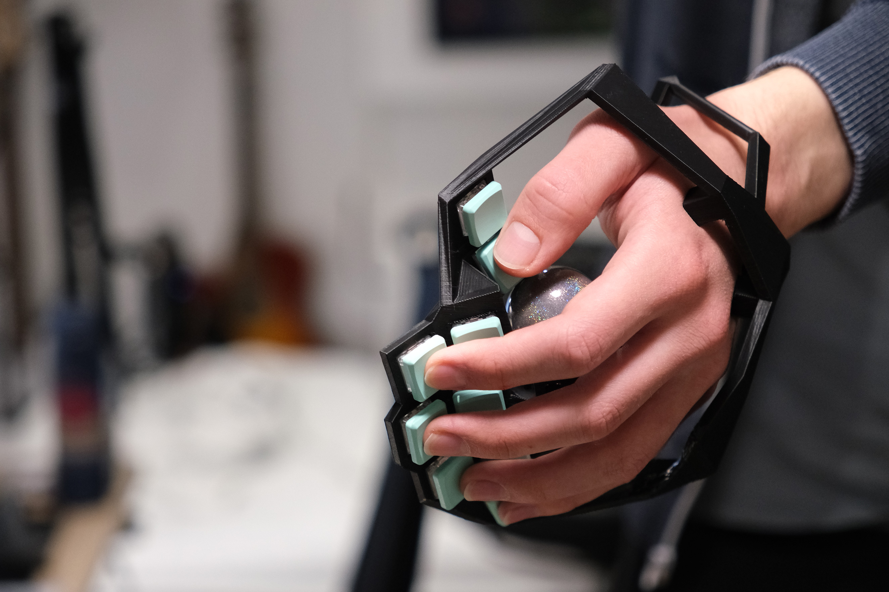

# Wearabord

A wearable ergonomic keyboard concept with an integrated trackball. Parts of [Bastardkb's](https://bastardkb.com/) work on their [Charybdis](https://github.com/Bastardkb/Charybdis) trackball mount were used.

This keyboard concept is intended to be personalized to the shape of your own hand. If you are interested in making one, you can follow [this beginner friendly guide to designing and building a Wearabord of your own](/docs/build_guide.md).

Feel free to [open an issue](https://docs.github.com/en/issues/tracking-your-work-with-issues/creating-an-issue) in this GitHub repository to share any thoughts on the project or your own build.

# Features and Demo

The current version of the Wearabord concept is designed to support the following features:

- Wearable
- One trackball per hand
- Custom stagger and splay based on hand shape and finger length
- Two keys per finger
- Chorded input layout ([Taipo](https://inkeys.wiki/en/keymaps/taipo))
- Can be used one-handed
- Wired split functionality
- MX or choc compatible

If you are interested in following the guide, you are of course able to personalize your design according to your own preferences.

https://github.com/wulphred/wearabord/assets/155734133/394db9b3-82f9-4098-9001-75f46a317a3b

# Personal Build

For my personalized version I used the following parts:

- 0xCB Helios microcontroller
- Pink Kailh Low Profile Choc Switches (20g)
- Choc Kailh Hotswap Sockets
- MBK PBT Coloured Blank Keycaps (Artic Blue & Mint Green)
- Perixx PERIPRO-303 GSL Trackball

# Firmware and Layout

This keyboard runs on QMK and uses a modification of [dlip's Taipo Layout Implementation](https://github.com/dlip/qmk_firmware/blob/chouchou/users/dlip/taipo.md) that enables trackball usage.

Description of the layout by whorf:

>Taipo is a two-handed chording system that can be used one-handed (based on your firmware setup) because it is simply two, full, mirrored keyboards that you can 100% alternate between. It uses 2 keys per finger, 10 keys per hand, 20 keys total. All characters are single chords involving 3 or fewer keys and nothing requires holds except for modifiers (for two handed). There is zero consecutive hand or finger usage when using it with two hands and Taipo's biggest benefit is its consistent flow and ease of access to all symbols.

[More info](https://inkeys.wiki/en/keymaps/taipo)

# Roadmap

Features for future revisions

- [ ] Cable management inside of the frame
- [ ] Wireless functionality
- [ ] Cirque trackpad support
- [ ] Modular frame to allow for foldability to transport the board in a bag
- [ ] Modular frame to allow for swapping trackball and trackpad mods
- [ ] Thumbscrews to adjust tightness and make attaching to and detaching from hands easier
- [ ] Modularized, interchangeable frame pieces to accommodate different hand sizes
- [ ] STL model generation using a hand scanner, like [Cosmos](https://github.com/rianadon/Cosmos-Keyboards/)
- [ ] Holdable variant, like the [Azeron Cyro](https://store.azeron.eu/azeron-keypads#keypad=cyro)

# License and Attribution

This work is licensed under a Creative Commons Attribution-ShareAlike 4.0 International License.

The following files contain [the following work](https://github.com/Bastardkb/Charybdis/blob/main/files/mods/printable-btu-screws/bottom.stl) by [Quentin](https://github.com/bstiq) from [Bastardkb](https://github.com/Bastardkb), which is licensed under a Creative Commons Attribution-NonCommercial-ShareAlike 4.0 International License, and are therefore licensed under the same license.

- [files/stl/wearabord-frame/v1.stl](files/stl/wearabord-frame/v1.stl)
- [files/cura/v1.3mf](files/cura/v1.3mf)
- [files/blender/wearabord.blend](files/blender/wearabord.blend)
- [docs/media/blender_3d_print_toolbox.png](docs/media/blender_3d_print_toolbox.png)
- [docs/media/blender_bridge_faces.png](docs/media/blender_bridge_faces.png)
- [docs/media/blender_frame_result.png](docs/media/blender_frame_result.png)
- [docs/media/blender_grip2.png](docs/media/blender_grip2.png)
- [docs/media/blender_grip3.jpg](docs/media/blender_grip3.jpg)
- [docs/media/blender_grip4.jpg](docs/media/blender_grip4.jpg)
- [docs/media/blender_normal_transform_orientation.png](docs/media/blender_normal_transform_orientation.png)
- [docs/media/blender_trackball_position.png](docs/media/blender_trackball_position.png)
- [docs/media/cura_orientation.png](docs/media/cura_orientation.png)
- [media/left.png](media/left.png)
- [media/right.png](media/right.png)

The following files contain [the following work](https://github.com/Bastardkb/Charybdis/blob/main/files/3x5%20nano/charybdisnano_v2_v187.stl) by [Quentin](https://github.com/bstiq) from [Bastardkb](https://github.com/Bastardkb), which is licensed under a Creative Commons Attribution-NonCommercial-ShareAlike 4.0 International License, and are therefore licensed under the same license.

- [files/stl/scew-insert-sockets/screw_insert_sockets.stl](files/stl/scew-insert-sockets/screw_insert_sockets.stl)
- [files/cura/v1.3mf](files/cura/v1.3mf)
- [files/stl/wearabord-frame/v1.stl](files/stl/wearabord-frame/v1.stl)
- [files/blender/wearabord.blend](files/blender/wearabord.blend)
- [docs/media/blender_frame_result.png](docs/media/blender_frame_result.png)
- [media/left.png](media/left.png)
- [media/right.png](media/right.png)

The following files contain [the following work](https://github.com/Bastardkb/Charybdis/blob/main/files/mods/printable-btu/printable_btu_2.5mm_ball.stl) by [Carl-Fredrik Arvidson](https://github.com/cfarvidson), which is licensed under a Creative Commons Attribution-NonCommercial-ShareAlike 4.0 International License, and are therefore licensed under the same license.

- [docs/media/blender_lasso.png](docs/media/blender_lasso.png)
- [docs/media/blender_outer_edges.png](docs/media/blender_outer_edges.png)
- [media/left.png](media/left.png)
- [media/right.png](media/right.png)

The following files contain [the following work](https://github.com/Bastardkb/Charybdis/blob/main/files/mods/veichu/veichu.stl) by [Quentin](https://github.com/bstiq) from [Bastardkb](https://github.com/Bastardkb), which is licensed under a Creative Commons Attribution-NonCommercial-ShareAlike 4.0 International License, and are therefore licensed under the same license.

- [media/demo.mp4](media/demo.mp4)
